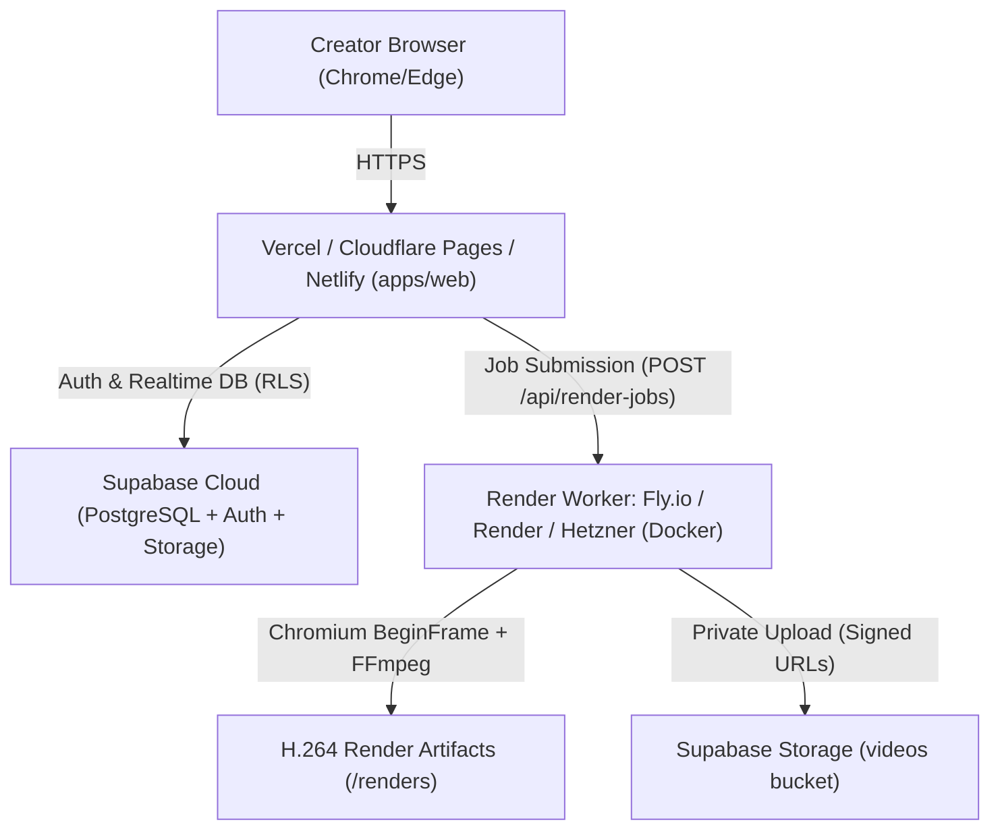

# FrameForge Production Deployment Guide

This guide details the complete, step-by-step production deployment strategy for FrameForge, adhering to the architecture and security constraints outlined in **PRD Section 8, 12, 14, and 18**.

---

## Architecture Topology



---

## Prerequisites & External Services

1. **GitHub Repository**: [github.com/abdulah-0/FrameForge.git](https://github.com/abdulah-0/FrameForge.git)
2. **Supabase Project** (Database, Auth, Storage): [supabase.com](https://supabase.com)
3. **Web Frontend Hosting**: Vercel, Cloudflare Pages, or Netlify
4. **Render Worker Compute**: Fly.io, Render, Railway, or VPS (Hetzner/DigitalOcean) with Docker support (minimum 2 vCPU, 2GB-4GB RAM)
5. **(Optional) AI & Media APIs**: Google Gemini API key or self-hosted Ollama; Pexels API key.

---

## Step 1: Database & Storage Setup (Supabase)

1. Create a new Supabase project (choose the region closest to your users, e.g., `us-east-1` or `eu-central-1`).
2. Navigate to **SQL Editor** in the Supabase Dashboard.
3. Open [`supabase/migrations/20261004000001_initial_schema.sql`](file:///c:/Users/snake/OneDrive/Desktop/FrameForge/supabase/migrations/20261004000001_initial_schema.sql) in this repository and execute the migration.
   - This creates `profiles`, `projects`, `assets`, `render_jobs`, and `usage_events`.
   - Automatically activates Row Level Security (RLS) policies on all tables so users can only access their own records.
4. Navigate to **Storage** in the Supabase Dashboard:
   - Create a bucket named `assets` (Public: **OFF**).
   - Create a bucket named `videos` (Public: **OFF**).
   - Set RLS policies allowing authenticated users to upload and download objects where the folder matches `auth.uid()`.
5. Under **Project Settings > API**, record:
   - `Project URL`
   - `anon public` key
   - `service_role` secret key (Keep private, server-only)

---

## Step 2: Deploy the Isolated Render Worker (Docker)

The render worker requires headless Chromium and FFmpeg with sufficient CPU and memory.

### Option A: Fly.io (Recommended for isolated containers)

1. Install the Fly CLI: `curl -L https://fly.io/install.sh | sh` (or `winget install flyctl` on Windows).
2. Authenticate: `fly auth login`.
3. In the root directory or inside `apps/render-worker`:
   ```bash
   fly launch --dockerfile apps/render-worker/Dockerfile --name frameforge-render-worker
   ```
4. Allocate sufficient memory for headless Chromium BeginFrame rendering (minimum 2GB):
   ```bash
   fly scale memory 2048
   fly scale vm shared-cpu-2x
   ```
5. Set environment secrets:
   ```bash
   fly secrets set \
     PORT=3100 \
     NODE_ENV=production \
     RENDER_WORKER_SECRET="your-generated-secret-key" \
     SUPABASE_URL="https://your-project.supabase.co" \
     SUPABASE_SERVICE_ROLE_KEY="eyJh..."
   ```
6. Deploy:
   ```bash
   fly deploy
   ```
7. Verify health check:
   ```bash
   curl https://frameforge-render-worker.fly.dev/health
   # Response: {"status":"ok","service":"frameforge-render-worker","port":3100}
   ```

### Option B: Linux VPS / Docker Host (Hetzner, DigitalOcean)

1. Clone repository on the server:
   ```bash
   git clone https://github.com/abdulah-0/FrameForge.git
   cd FrameForge
   ```
2. Build container:
   ```bash
   docker build -t frameforge-render-worker -f apps/render-worker/Dockerfile .
   ```
3. Run container with memory caps and isolated non-root user:
   ```bash
   docker run -d \
     --name frameforge-worker \
     --restart unless-stopped \
     -p 3100:3100 \
     --memory="2g" \
     --cpus="2" \
     --env-file .env.production \
     frameforge-render-worker
   ```
4. Put behind Nginx or Caddy reverse proxy with Let's Encrypt SSL.

---

## Step 3: Deploy the Frontend Studio (apps/web)

### Deploying to Vercel

1. Log in to [vercel.com](https://vercel.com) and click **Add New Project**.
2. Import the GitHub repository `abdulah-0/FrameForge`.
3. Configure project settings:
   - **Framework Preset**: Vite
   - **Root Directory**: `apps/web`
   - **Build Command**: `npm run build`
   - **Output Directory**: `dist`
   - **Install Command**: `npm install`
4. Add Environment Variables:
   - `VITE_SUPABASE_URL`: `https://your-project.supabase.co`
   - `VITE_SUPABASE_ANON_KEY`: `your-supabase-anon-key`
   - `VITE_RENDER_WORKER_URL`: `https://frameforge-render-worker.fly.dev` (or your worker URL)
5. Click **Deploy**.

---

## Step 4: Verification and Smoke Testing

Run the following smoke tests on the live deployment:

1. **Live Health Check**:
   - Send `GET` to `https://<YOUR-WORKER-URL>/health` $\to$ verify HTTP 200 OK.
2. **SSRF Defensive Verification**:
   - Submit a test project with `media.url = "http://169.254.169.254/latest/meta-data/"` $\to$ verify HTTP 400 Bad Request with `"Security violation (SSRF Prevention)"`.
3. **Quota Rejection**:
   - Submit a test project with duration exceeding 30.0s $\to$ verify HTTP 400 Bad Request with quota warning.
4. **End-to-End Render Smoke Test**:
   - Open deployed Studio UI in Chrome or Edge.
   - Load starter project fixture (e.g. Faceless Short).
   - Click **Export Video (MP4)** $\to$ choose Cloud Export.
   - Watch live stage updates: `preparing` $\to$ `rendering` $\to$ `encoding` $\to$ `complete`.
   - Download finished `.mp4` file and play locally.

---

## Step 5: Post-Deployment Monitoring & Maintenance

- **Worker Log Monitoring**: Monitor Chromium memory consumption and verify subprocess cleanup.
- **Render Directory Sweeper**: The worker stores temporary MP4s in `/app/renders`. Set up a cron task or storage lifecycle rule to delete videos older than 24 hours (`OUTPUT_RETENTION_HOURS=24`).
- **Cost Ceilings**: Check Supabase database disk usage and provider API consumption weekly to prevent unexpected cost creep.
